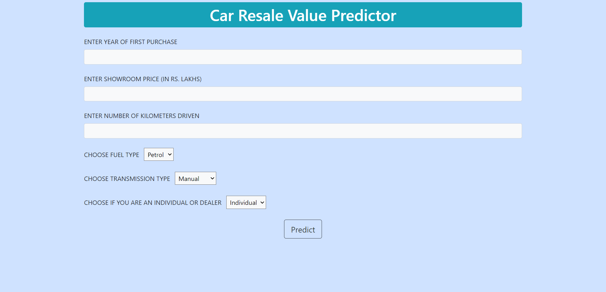
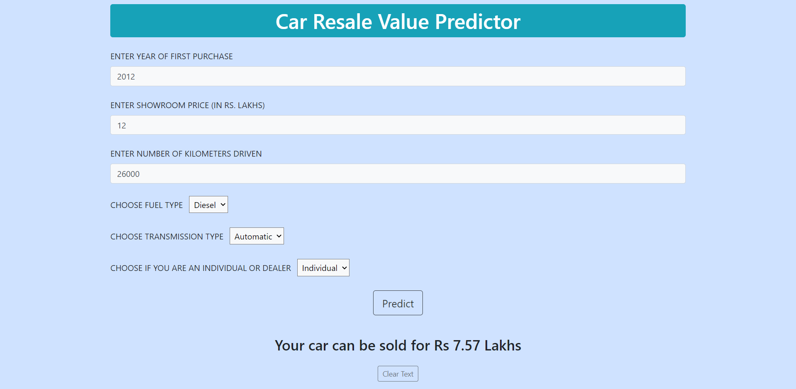

# Car Resale Value Prediction

Here is a web application to predict the resale value of used cars. You can also visit the web application [here](https://car-resale-value-prediction-rd.herokuapp.com/).

## Dataset Used
* Vehicle Dataset - from Kaggle
* 'car data.csv' file was used for training
* [Link to dataset](https://www.kaggle.com/nehalbirla/vehicle-dataset-from-cardekho)

## Technologies Used
* Python 
* Flask
* Random Forest Regressor 
* Pickle

## Installations Required
* click==7.1.2
* Flask==1.1.2
* itsdangerous==1.1.0
* Jinja2==2.11.3
* joblib==1.0.1
* MarkupSafe==1.1.1
* numpy>=1.19.5
* scikit-learn==0.24.1
* scipy>=1.5.4
* sklearn==0.0
* threadpoolctl==2.1.0
* Werkzeug==1.0.1

## Screenshots

